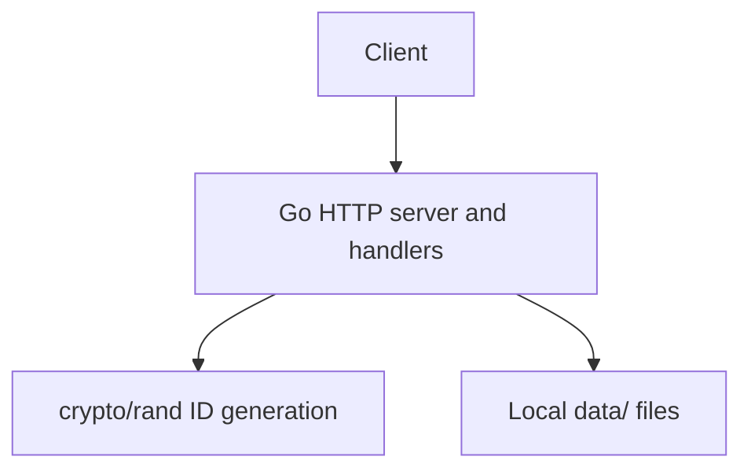

# Architecture

DirectBin is a single Go HTTP server. Routing, request handlers, ID generation, and filesystem operations are implemented together in `main.go`. Tests exercise the handlers through Go's `httptest` package. There is no database, external storage service, message broker, or separate backend service.

## Request and storage flow



For source execution, `data/` is relative to the process working directory. The application creates it if it does not exist. In the Docker image, the working directory is `/`, so the storage directory is `/data`.

### Create a paste

`POST /paste` reads the complete request body, generates an eight-character URL-safe ID, then creates `data/<id>` exclusively with file mode `0600` and writes the submitted bytes. Exclusive creation prevents an ID collision from overwriting an existing file; the server retries up to ten times. On success it returns the ID as JSON with `201 Created`.

### Retrieve a paste

`GET /paste/{id}` reads `data/<id>` and writes its bytes to the response with content type `application/octet-stream`. A missing file returns `404 Not Found`; other read errors return `500 Internal Server Error`.

### Retrieve raw content

`GET /paste/{id}/raw` uses the same retrieval handler and returns the same stored bytes. It provides a direct response body for command-line clients and output redirection.

### Delete a paste

`DELETE /paste/{id}` removes `data/<id>`. It returns `204 No Content` on success, `404 Not Found` when the file does not exist, and `500 Internal Server Error` for other filesystem errors.

### Health check

`GET /health` returns `{"status":"ok"}` with `200 OK`. It checks that the HTTP handler responds; it does not test storage health.

## Deployment

```text
flowchart LR
    Client --> HTTP["DirectBin HTTP server / process"]
    HTTP --> Files["Local filesystem<br/>data/&lt;id&gt;"]
```

The Dockerfile builds a Go binary in a separate stage and runs it as the non-root `directbin` user in an Alpine runtime image. It declares `/data` as a volume and checks `/health`. `compose.yaml` publishes port 8080 and mounts a named volume at `/data`. This preserves files for a single Compose deployment across container recreation.

## Scaling limitation

Each DirectBin instance reads and writes its own local filesystem. Multiple independent instances do not automatically share paste files; routing a later retrieval request to another instance may therefore fail. The Compose volume addresses persistence for one deployment, not shared storage among replicas. A load balancer or Kubernetes does not solve this storage constraint on its own.

`k8s/README.md` reserves a directory for future Kubernetes work. No Kubernetes manifests or Kubernetes deployment are currently part of the project.
